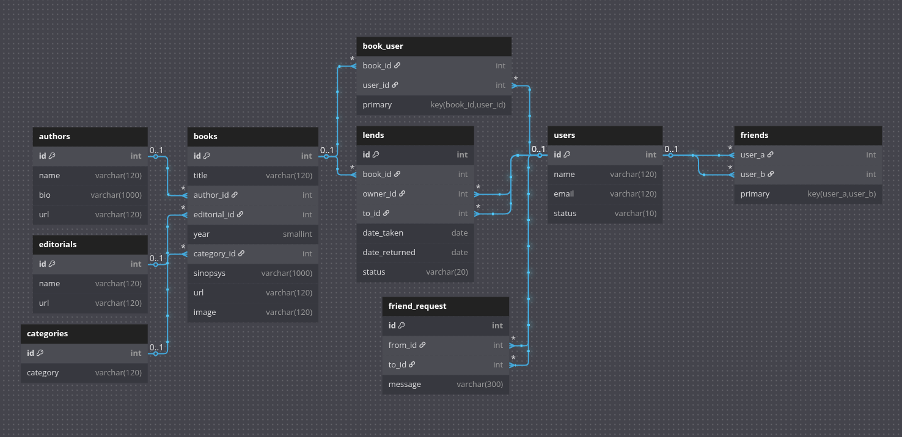

# Lend me

A small app to keep track of the books you lend with your friends... It was made to exercise and improve my habillities in express and postgresql, tackling a little of data validation, error handling, cookies, jwt and user flow.

## the idea

So, the idea was to create an app that helps you handling the inventory of your books, keep track request a book, lend, borrow from your friends and search for titles within your circle.

I've made a couple of test users so you can play with it:

- User: 'Juan Pérez', Pass: '<juan@example.com>',
- User: 'María García', Pass: '<maria@example.com>',
- User: 'Carlos López', Pass: '<carlos@example.com>',
- User: 'Ana Martínez', Pass: '<ana@example.com>',
- User: 'Luisa Rodríguez', Pass: '<luisa@example.com>',

The validation only happens in two points, in the html form and in the server... I know, I should had made a third validation, client side with JS, but, this is a toy project and JS validation was not the point.

## DB diagram

